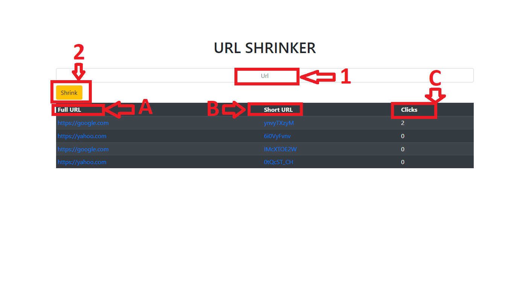

# ShortLink By Snmoyano

## Acortador URL

### Su funcion principal es acortar url y retornarnos un link corto y a su vez alojarlas en una DB realizada en MongoDB utilizando Node JS.

## Dependencias del Proyecto:

<ul>
<li>Ejs</li>
<li>Express</li>
<li>Mongoose</li>
<li>Short Id</li>
<li>Dotenv</li>
</ul>

## Modelos del Proyecto:

```javascript
  full: {
    type: String,
  },
  short: {
    type: String,
  },
  clicks: {
    type: Number,
  },
```

## Instalar dapendencias:

```javascript
npm install
```

## Configurar variables de entorno:

```javascript
'Crear archivo .env y colocar la siguiente variable'
PORT = => 'colocar puerto deseado '
```

## Poner en funcionamiento APi:

```javascipt
npm run dev
```

## Funcionabilidad:



### 1 - . Colocamons la Url a Acortar.

```javascript
https://example.com
```

### 2 - . Presionamos el botón SHRINK.

```javascript
shrink: Ejecuta el acortador
```

## Layout:

### A - . Full Url

```javascript
https://example.com => url ingresada
```

### B - . Short Url

```javascript
;(YsEtYdSS) => 'url acortada'
```

### C - . Clicks

```javascript
count = (clicks) => 'contador de veces acortada la misma url'
```

<footer>
<h4>API creada por Snmoyano</h4>
</footer>
